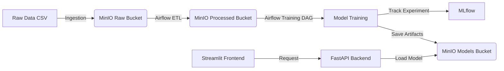
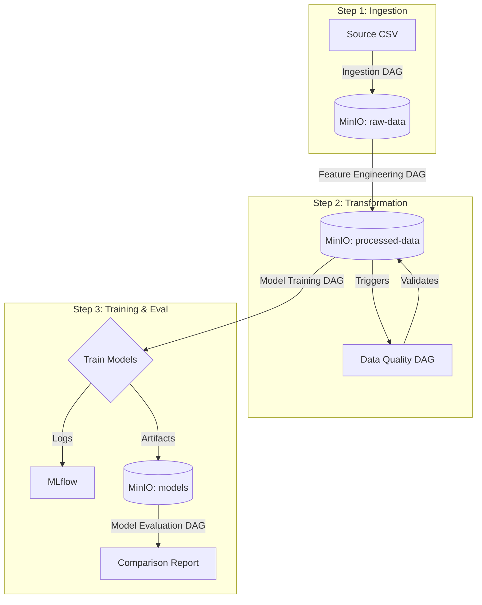

# Customer Churn MLOps Project Documentation

**Version:** 1.0.0  
**Last Updated:** 2026-02-23  
**Status:** Active

---

## 1. Project Overview

### 1.1 Introduction

The Customer Churn MLOps Project is a comprehensive machine learning operations pipeline designed to predict customer churn (classification) and forecast customer lifetime value (regression) for a retail business. This project distinguishes itself by implementing core machine learning algorithms from scratch (without relying on `sklearn` for model logic) while leveraging industry-standard MLOps tools for orchestration, tracking, and deployment.

### 1.2 Objectives

The primary goals of this project are:

1.  **Churn Prediction (Classification):** Identify customers at risk of leaving the platform (`churned = 1`) to enable proactive retention strategies.
    - **Metric:** F1-Score (to handle class imbalance).
2.  **Sales Forecasting (Regression):** Predict the total sales value (`total_sales`) a customer will generate.
    - **Metric:** RMSE (Root Mean Square Error) and R².
3.  **Educational Implementation:** Demonstrate the inner workings of ML algorithms by implementing them from scratch (e.g., Logistic Regression, Random Forest, SVM).
4.  **Production-Grade MLOps:** Establish a robust pipeline using Airflow, MinIO, MLflow, and Docker.

---

## 2. Technical Architecture

### 2.1 High-Level Architecture

The system follows a microservices architecture managed by Docker Compose. Data flows from ingestion to processing, training, and finally to serving via an API and Dashboard.



### 2.2 Component Stack

| Component               | Technology     | Description                    | Rationale                                                                             |
| ----------------------- | -------------- | ------------------------------ | ------------------------------------------------------------------------------------- |
| **Orchestration**       | Apache Airflow | Workflow management            | Handles complex dependencies between data ingestion, engineering, and training tasks. |
| **Storage**             | MinIO          | Object Storage (S3 Compatible) | Decouples storage from compute; simulates cloud S3 environment locally.               |
| **Experiment Tracking** | MLflow         | Model Registry & Tracking      | Logs metrics, parameters, and artifacts for every training run.                       |
| **Backend API**         | FastAPI        | Python Web Framework           | High-performance, async API for serving model predictions.                            |
| **Frontend**            | Streamlit      | Data App Framework             | Rapid development of an interactive dashboard for business users.                     |
| **Database**            | PostgreSQL     | Relational DB                  | Persistent storage for Airflow metadata and MLflow backend store.                     |
| **Cache/Broker**        | Redis          | In-memory Data Store           | Message broker for Airflow Celery executor.                                           |
| **Containerization**    | Docker         | Container Platform             | Ensures consistent environment across development and deployment.                     |

---

## 3. Setup and Installation

### 3.1 Prerequisites

- **Docker** and **Docker Compose** installed.
- **Git** for version control.
- **8GB+ RAM** recommended for running all services simultaneously.

### 3.2 Installation Steps

1.  **Clone the Repository**

    ```bash
    git clone https://github.com/your-org/customer-churn-mlops.git
    cd customer-churn-mlops
    ```

2.  **Initialize Directories**
    Create necessary local directories for volume mapping:

    ```bash
    mkdir -p logs dags plugins data
    ```

3.  **Start Infrastructure**
    Launch the full stack using Docker Compose:

    ```bash
    docker-compose up -d
    ```

4.  **Verify Services**
    Ensure all containers are healthy:
    ```bash
    docker-compose ps
    ```

### 3.3 Access Points

| Service           | URL                          | Default Credentials              |
| ----------------- | ---------------------------- | -------------------------------- |
| **Airflow UI**    | `http://localhost:8080`      | `airflow` / `airflow`            |
| **MinIO Console** | `http://localhost:9001`      | `minio_admin` / `minio_password` |
| **MLflow UI**     | `http://localhost:5001`      | N/A                              |
| **API Docs**      | `http://localhost:8000/docs` | N/A                              |
| **Dashboard**     | `http://localhost:8501`      | N/A                              |

---

## 4. Development Environment

### 4.1 Project Structure

```
customer-churn-mlops/
├── backend/                # FastAPI application
│   ├── core/               # Core logic (MinIO client, config)
│   ├── routers/            # API endpoints (predict, metrics)
│   └── main.py             # Entry point
├── dags/                   # Airflow DAGs (Workflows)
├── frontend/               # Streamlit Dashboard
├── src/                    # Shared ML Source Code
│   ├── models_scratch/     # Custom ML implementations
│   └── utils/              # Helper functions
├── data/                   # Local data storage (mapped to containers)
└── docker-compose.yaml     # Infrastructure definition
```

### 4.2 Coding Standards

- **Python Version:** 3.8+
- **Style Guide:** PEP 8 compliance.
- **Type Hinting:** Required for all function signatures (e.g., `def train(self, X: np.ndarray) -> None:`).
- **Documentation:** Docstrings required for all classes and public methods.

---

## 5. Data & Database Schema

### 5.1 Data Source

The project uses a synthetic retail dataset (`retail_data.csv`) containing approximately 1,000 customer records.

### 5.2 Key Features

The dataset includes over 70 features categorized into:

- **Demographics:** Age, Gender, Location, Education.
- **Behavior:** Loyalty Status, Purchase Frequency, Days Since Last Purchase.
- **Financial:** Total Spent, Average Purchase Value, Income.
- **Interactions:** Support Calls, Website Visits, App Usage.

### 5.3 Data Flow

1.  **Raw Data:** Ingested from CSV to `s3://raw-data/retail_data.parquet` in MinIO.
2.  **Processed Data:** Cleaned and feature-engineered data stored in `s3://processed-data/training_data.parquet`.

---

## 6. ML Implementation Strategy

### 6.1 "From Scratch" Philosophy

All core algorithms are implemented in `src/models_scratch/` using `numpy` for matrix operations. This ensures a deep understanding of the mathematical foundations.

**Base Model Contract (`src/models_scratch/base.py`):**
All models inherit from `BaseModel` and implement:

- `fit(X, y, epochs, lr)`: Trains the model using gradient descent or analytical solutions.
- `predict(X)`: Generates predictions.
- `save/load`: Handles serialization (pickle) and MinIO persistence.

### 6.2 Implemented Models

**Classification (Target: `churned`)**

1.  Logistic Regression
2.  Decision Tree
3.  Random Forest
4.  Support Vector Machine (SVM)
5.  K-Means Clustering
6.  Agglomerative Clustering
7.  Perceptron
8.  Multi-Layer Perceptron (MLP)
9.  Naive Bayes (Custom)
10. Random Forest + PCA
11. SVM + PCA

**Regression (Target: `total_sales`)**

1.  Linear Regression
2.  Multiple Regression
3.  Polynomial Regression
4.  XGBoost (Gradient Boosting)

---

## 7. API Specifications

The backend is built with FastAPI and exposes REST endpoints.

### 7.1 Base URL

`http://localhost:8000/api`

### 7.2 Endpoints

#### `POST /predict`

Generates a prediction for a single customer.

**Request Body:**

```json
{
  "features": {
    "age": 34,
    "income": 75000,
    "total_transactions": 45,
    ...
  },
  "model_name": "random_forest",
  "model_type": "classification"
}
```

**Response:**

```json
{
  "prediction": 1,
  "probability": 0.85,
  "model_used": "random_forest"
}
```

#### `GET /metrics`

Retrieves current model performance metrics from MLflow.

---

## 8. Authentication & Security

### 8.1 Service Authentication

- **Airflow:** Uses basic authentication (`airflow`/`airflow`).
- **MinIO:** Uses access key and secret key (`minio_admin`/`minio_password`).
- **PostgreSQL:** Protected via internal network and password authentication.

### 8.2 API Security

- The current FastAPI implementation allows public access (for development simplicity).
- **Recommendation:** For production, implement OAuth2 with JWT tokens using `fastapi.security`.

---

## 9. Testing Strategies

### 9.1 Unit & Integration Tests

Located in the `tests/` directory:

- **`test_prediction_api.py`**: Integration tests that validate the API endpoints against running services. It verifies that different customer profiles (Loyal vs. Churn Risk) yield logical predictions.
- **`verify_feature_engineering.py`**: Behavioral tests that check if specific feature changes (e.g., increasing "Engagement Score") correctly influence the model's output probability.

### 9.2 Test Coverage

- **API Tests:** Cover successful predictions, error handling, and model selection.
- **Model Tests:** Validation scripts ensure that "from scratch" models converge and perform better than random guessing.

---

## 10. Deployment & Performance

### 10.1 Performance Optimization

- **Vectorization:** All "from scratch" models utilize `numpy` vectorization to speed up matrix operations (dot products, broadcasting) instead of Python loops.
- **Data Format:** Uses **Parquet** for intermediate data storage in MinIO, which is significantly faster and smaller than CSV.
- **Caching:** Streamlit dashboard uses `@st.cache_data` to minimize API calls and re-rendering.

### 10.2 Deployment Pipeline

The deployment is simulated via Docker Compose.

1.  **Continuous Integration (CI):**
    - Linting and unit tests run on push.
2.  **Continuous Deployment (CD):**
    - Airflow DAGs automatically pick up new code mounted in volumes.
    - Retraining pipelines can be triggered manually or on a schedule.

---

## 11. Operations & Maintenance

### 11.1 Monitoring

- **Pipeline Health:** Check Airflow DAGs for failures (Red tasks).
- **Model Performance:** Check MLflow UI for metric degradation over time.
- **System Health:** Use `docker-compose ps` to monitor container status.

### 11.2 Backup & Recovery

- **Data:** Regularly backup MinIO volume `minio_data`.
- **Metadata:** Backup Postgres volume `postgres-db-volume`.

### 11.3 Troubleshooting

- **Service fails to start:** Check logs with `docker-compose logs <service_name>`.
- **MinIO Connection Error:** Verify `MINIO_ENDPOINT` and credentials in environment variables.
- **Model not found:** Ensure the training DAG has run successfully and artifacts are visible in MinIO `models` bucket.

---

## 13. ELT Pipeline Workflow

### 13.1 Overview

The project employs a robust Extract, Load, Transform (ELT) pipeline orchestrated by Apache Airflow. Unlike traditional ETL, we load raw data into our Data Lake (MinIO) first, then transform it for machine learning purposes. This preserves the original data fidelity and allows for flexible downstream transformations.

**Pipeline Visual Flow:**



### 13.2 Step 1: Data Ingestion

- **DAG Name:** `retail_data_ingestion_pipeline`
- **Frequency:** `@once` (or on-demand when new data arrives)
- **Source:** `data/raw/retail_data.csv`
- **Destination:** `s3://raw-data/retail_data.parquet`

**Process:**

1.  **Extraction:** The DAG reads the raw CSV file provided in the `data/` directory.
2.  **Format Conversion:** It converts the CSV to **Parquet** format.
    - _Why?_ Parquet is a columnar storage format that is highly efficient for analytics. It compresses data (reducing storage by ~60%) and speeds up read operations by allowing column-pruning (reading only necessary features).
3.  **Loading:** The Parquet file is uploaded to the MinIO `raw-data` bucket.

### 13.3 Step 2: Feature Engineering

- **DAG Name:** `retail_feature_engineering_pipeline`
- **Dependency:** Requires `retail_data.parquet` in MinIO.
- **Output:** `s3://processed-data/training_data.parquet`

**Process:**

1.  **Cleaning:** Drops identifier columns (`customer_id`, `transaction_id`) that have no predictive power.
2.  **Encoding:**
    - **Categorical:** Applies One-Hot Encoding to columns like `product_category` and `payment_method`.
    - **Binary:** Maps Yes/No fields to 1/0 (e.g., `churned`, `loyalty_program`).
3.  **Feature Creation:**
    - `quantity_times_price`: Interaction feature capturing total transaction value before discounts.
    - `engagement_score`: Composite metric derived from app usage, social media engagement, and email subscriptions.
4.  **Target Synthesis:**
    - Generates `total_sales` (Regression Target) with added noise to simulate real-world variance.
    - Generates `churned` (Classification Target) logic based on recency and frequency.
5.  **Trigger:** Upon successful completion, this DAG automatically triggers the `data_quality_validation` DAG using the `TriggerDagRunOperator`.

### 13.4 Step 3: Data Quality Validation

- **DAG Name:** `data_quality_validation`
- **Triggered By:** `retail_feature_engineering_pipeline`
- **Goal:** Gatekeeper mechanism to prevent bad data from reaching models.

**Validation Checks:**

1.  **Freshness:** Alerts if data is older than 30 days.
2.  **Schema:** Verifies that all expected columns (e.g., `age`, `income`) exist.
3.  **Completeness:** Checks for null values in critical columns.
4.  **Target Health:**
    - Ensures `total_sales` is positive and distributed normally.
    - Checks `churned` for extreme class imbalance (alerts if minority class < 30%).

### 13.5 Step 4: Model Training

- **DAG Name:** `model_training_pipeline`
- **Execution:** Manual Trigger (after validating data quality).
- **Output:** Trained model artifacts in `s3://models/` and metrics in MLflow.

**Workflow:**

1.  **Pre-flight Check:** Verifies `training_data.parquet` exists and passes basic schema checks.
2.  **Parallel Training:**
    - **Task A (Classification):** Trains 11 classifiers (Logistic Regression, SVM, Random Forest, etc.) from scratch.
    - **Task B (Regression):** Trains 4 regression models (Linear, Polynomial, XGBoost) from scratch.
3.  **Logging:** Every model run logs:
    - **Parameters:** Hyperparameters (learning rate, epochs).
    - **Metrics:** Loss history, final accuracy/RMSE.
    - **Artifacts:** The serialized model object (pickle).

### 13.6 Step 5: Model Evaluation

- **DAG Name:** `model_evaluation_pipeline`
- **Goal:** Comparative analysis to select the "Champion" model.

**Process:**

1.  **Load Artifacts:** Fetches all trained models from the MinIO `models` bucket.
2.  **Test Set Evaluation:** Runs predictions on a holdout dataset.
3.  **Metric Calculation:**
    - _Classification:_ Accuracy, Precision, Recall, F1-Score.
    - _Regression:_ RMSE, MAE, R², MAPE.
4.  **Reporting:** Generates a comparison summary (JSON/Markdown) identifying the best performing model for each task.

## 14. Troubleshooting Guide

### 14.1 Common Pipeline Errors

**Issue: Ingestion Fails with "FileNotFoundError"**

- _Cause:_ The `data/raw/retail_data.csv` file is missing from the mapped volume.
- _Fix:_ Ensure the file exists in your local `data/raw/` directory before running the DAG.

**Issue: Data Quality Check Fails**

- _Cause:_ Schema mismatch or "stale data" warning.
- _Fix:_ Check the logs in Airflow. If data is too old, re-run the Ingestion DAG. If columns are missing, check if the source CSV format has changed.

**Issue: Model Training OOM (Out of Memory)**

- _Cause:_ Training multiple "from scratch" models in parallel on a machine with limited RAM (<8GB).
- _Fix:_ Open `dags/model_training_dag.py` and remove parallel dependencies (make tasks sequential) or increase Docker memory limits.

## 15. Changelog

### Version 1.0.0 (2026-02-23)

- **Initial Release**: Complete implementation of the MLOps pipeline.
- **Features**:
  - Integrated 11 Classification and 4 Regression models (from scratch).
  - Airflow DAGs for ingestion, processing, and training.
  - FastAPI backend with prediction endpoints.
  - Streamlit dashboard for visualization.
  - MLflow integration for experiment tracking.
  - Comprehensive test suite for API and feature engineering verification.
